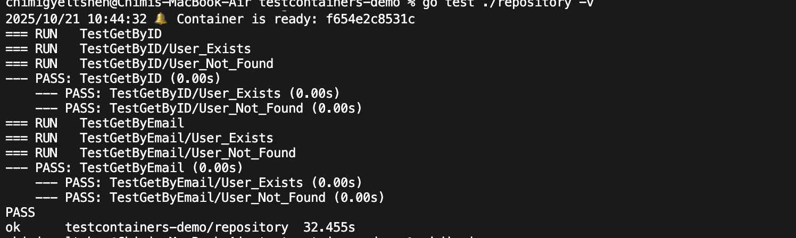
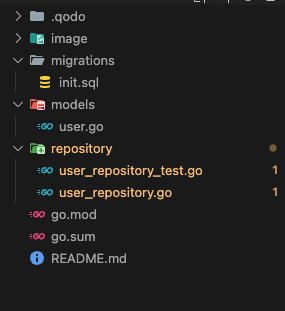
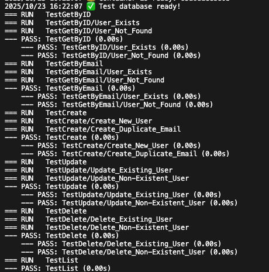
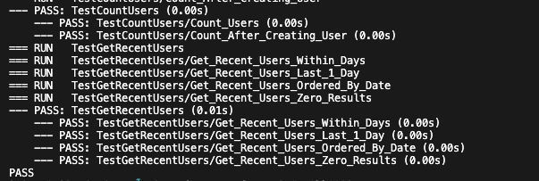
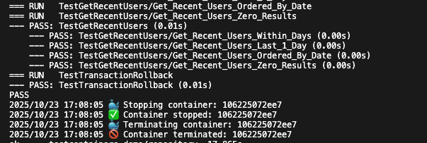
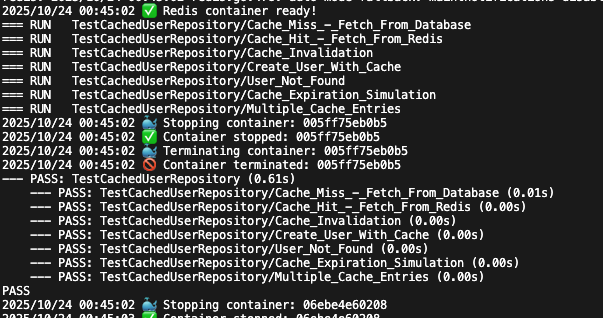

# Integration Testing with TestContainers for Database Testing

## [Repository Link](https://github.com/C-gyeltshen/testcontainers-go-tutorial.git)

## 1. Introduction to Integration Testing
### What is Integration Testing?

Integration testing is a level of software testing where individual units or components are combined and tested as a group. Unlike unit tests that test isolated pieces of code, integration tests verify that different parts of your system work together correctly.

**Key Characteristics:**
- Tests multiple components together
- Verifies interactions between components
- Uses real dependencies (databases, message queues, etc.)
- Slower than unit tests but more realistic
- Catches integration issues early

### What is TestContainers?

TestContainers is a library that provides lightweight, throwaway instances of databases, message brokers, web browsers, or anything that can run in a Docker container. It makes integration testing with real dependencies simple and reliable.

**TestContainers Benefits:**
- **Real Dependencies**: Test against actual databases, not mocks
- **Isolation**: Each test gets a fresh container
- **Portability**: Works on any machine with Docker
- **Clean State**: Containers are destroyed after tests
- **CI/CD Friendly**: Perfect for automated testing pipelines

### Why TestContainers for Database Testing?

Traditional approaches to database testing have problems:

| Approach | Problems |
|----------|----------|
| **In-Memory Databases (H2, SQLite)** | Different SQL dialects, missing features, not production-like |
| **Shared Test Database** | Flaky tests due to shared state, cleanup issues, slow |
| **Mocked Database** | Doesn't test actual SQL, misses database-specific bugs |
| **TestContainers** | ✅ Real database, isolated, production-like, reliable |

## 2. Prerequisites {#prerequisites}

Before starting this practical, ensure you have:

- [ ] Go installed (version 1.19 or higher)
- [ ] Docker Desktop installed and running
- [ ] Basic understanding of Go and SQL
- [ ] Familiarity with unit testing in Go (see Practical 2)
- [ ] A code editor (VS Code, GoLand, etc.)

## 3. Project Setup

Create a new Go project for this practical:

```bash
# Create project directory
mkdir testcontainers-demo
cd testcontainers-demo

# Initialize Go module
go mod init testcontainers-demo

# Install required dependencies
go get github.com/testcontainers/testcontainers-go
go get github.com/testcontainers/testcontainers-go/modules/postgres
go get github.com/lib/pq
```

## 4. Project Structure

```bash
    testcontainers-demo/
    ├── go.mod
    ├── go.sum
    ├── models/
    │   └── user.go          
    ├── repository/
    │   └── user_repository.go   
    │   └── user_repository_test.go  
    ├── migrations/
    │   └── init.sql        
    └── README.md
```

### Step 4.1: Create the Data Model

Create models/user.go:

```go 
// models/user.go
package models

import "time"

// User represents a user in our system
type User struct {
	ID        int       `json:"id"`
	Email     string    `json:"email"`
	Name      string    `json:"name"`
	CreatedAt time.Time `json:"created_at"`
}
```

### Step 4.2: Create Database Schema

Create migrations/init.sql:

```sql
-- migrations/init.sql
CREATE TABLE IF NOT EXISTS users (
    id SERIAL PRIMARY KEY,
    email VARCHAR(255) UNIQUE NOT NULL,
    name VARCHAR(255) NOT NULL,
    created_at TIMESTAMP DEFAULT CURRENT_TIMESTAMP
);

-- Insert some test data
INSERT INTO users (email, name) VALUES
    ('alice@example.com', 'Alice Smith'),
    ('bob@example.com', 'Bob Johnson');

```
### Step 4.3: Create Repository Layer

Create repository/user_repository.go:

```go
// repository/user_repository.go
package repository

import (
	"database/sql"
	"fmt"
	"testcontainers-demo/models"
)

// UserRepository handles database operations for users
type UserRepository struct {
	db *sql.DB
}

// NewUserRepository creates a new user repository
func NewUserRepository(db *sql.DB) *UserRepository {
	return &UserRepository{db: db}
}

// GetByID retrieves a user by their ID
func (r *UserRepository) GetByID(id int) (*models.User, error) {
	query := "SELECT id, email, name, created_at FROM users WHERE id = $1"

	var user models.User
	err := r.db.QueryRow(query, id).Scan(
		&user.ID,
		&user.Email,
		&user.Name,
		&user.CreatedAt,
	)

	if err == sql.ErrNoRows {
		return nil, fmt.Errorf("user not found")
	}
	if err != nil {
		return nil, fmt.Errorf("failed to get user: %w", err)
	}

	return &user, nil
}

// GetByEmail retrieves a user by their email
func (r *UserRepository) GetByEmail(email string) (*models.User, error) {
	query := "SELECT id, email, name, created_at FROM users WHERE email = $1"

	var user models.User
	err := r.db.QueryRow(query, email).Scan(
		&user.ID,
		&user.Email,
		&user.Name,
		&user.CreatedAt,
	)

	if err == sql.ErrNoRows {
		return nil, fmt.Errorf("user not found")
	}
	if err != nil {
		return nil, fmt.Errorf("failed to get user: %w", err)
	}

	return &user, nil
}

// Create inserts a new user
func (r *UserRepository) Create(email, name string) (*models.User, error) {
	query := `
		INSERT INTO users (email, name)
		VALUES ($1, $2)
		RETURNING id, email, name, created_at
	`

	var user models.User
	err := r.db.QueryRow(query, email, name).Scan(
		&user.ID,
		&user.Email,
		&user.Name,
		&user.CreatedAt,
	)

	if err != nil {
		return nil, fmt.Errorf("failed to create user: %w", err)
	}

	return &user, nil
}

// Update modifies an existing user
func (r *UserRepository) Update(id int, email, name string) error {
	query := "UPDATE users SET email = $1, name = $2 WHERE id = $3"

	result, err := r.db.Exec(query, email, name, id)
	if err != nil {
		return fmt.Errorf("failed to update user: %w", err)
	}

	rowsAffected, err := result.RowsAffected()
	if err != nil {
		return fmt.Errorf("failed to get rows affected: %w", err)
	}

	if rowsAffected == 0 {
		return fmt.Errorf("user not found")
	}

	return nil
}

// Delete removes a user
func (r *UserRepository) Delete(id int) error {
	query := "DELETE FROM users WHERE id = $1"

	result, err := r.db.Exec(query, id)
	if err != nil {
		return fmt.Errorf("failed to delete user: %w", err)
	}

	rowsAffected, err := result.RowsAffected()
	if err != nil {
		return fmt.Errorf("failed to get rows affected: %w", err)
	}

	if rowsAffected == 0 {
		return fmt.Errorf("user not found")
	}

	return nil
}

// List retrieves all users
func (r *UserRepository) List() ([]models.User, error) {
	query := "SELECT id, email, name, created_at FROM users ORDER BY id"

	rows, err := r.db.Query(query)
	if err != nil {
		return nil, fmt.Errorf("failed to list users: %w", err)
	}
	defer rows.Close()

	var users []models.User
	for rows.Next() {
		var user models.User
		err := rows.Scan(&user.ID, &user.Email, &user.Name, &user.CreatedAt)
		if err != nil {
			return nil, fmt.Errorf("failed to scan user: %w", err)
		}
		users = append(users, user)
	}

	if err = rows.Err(); err != nil {
		return nil, fmt.Errorf("error iterating users: %w", err)
	}

	return users, nil
}
```

### Running Tests



## **5. Lifecycle of Go tests**

```
┌──────────────────────────────────────────┐
│ go test ./repository -v                  │
└─────────────────┬────────────────────────┘
                  │
                  ▼
┌──────────────────────────────────────────┐
│ TestMain() executes                      │
│  1. Start PostgreSQL container 🐳        │ ← Your code goes here
│  2. Wait for "database system is ready"  │
│  3. Connect to database                  │
│  4. Store connection in testDB variable  │
└─────────────────┬────────────────────────┘
                  │
                  ▼
┌──────────────────────────────────────────┐
│ m.Run() - Execute all test functions     │
│  - TestGetByID()                         │
│  - TestGetByEmail()                      │
│  - TestCreate()                          │
│  - TestUpdate()                          │
│  - TestDelete()                          │
│  - TestList()                            │
└─────────────────┬────────────────────────┘
                  │
                  ▼
┌──────────────────────────────────────────┐
│ TestMain() cleanup                       │
│  1. Close database connection            │
│  2. Terminate container 🧹               │
│  3. Exit with test result code           │
└──────────────────────────────────────────┘
```

### 5.1. TestMain() executes first
Before any test runs: 
- It starts your PostgreSQL container (using Testcontainers-Go).

- Waits until the database logs show “database system is ready to accept connections.”

- Connects to that container’s database using a connection string.

- Stores that database connection in a shared variable (like testDB) that all tests can use.

### 5.2 m.Run() executes all test functions
This runs all test functions in your package, such as:
- TestGetByID()
- TestGetByEmail()
- TestCreate()
- TestUpdate()
- TestDelete()
- TestList()

### 5.3 Cleanup after tests
When m.Run() finishes:
- TestMain() closes the database connection.

- Stops and removes the PostgreSQL container (Ryuk or Testcontainers handles cleanup).

- Finally, it exits with the test result code (pass/fail).


## 6 Exercise 

### Exercise 1. 

**Tasks :**

1. Create the project structure
2. Implement the User model
3. Create the database schema (init.sql)
4. Write the repository layer
5. Write basic integration tests for GetByID and GetByEmail

	

### Exercise 2.

**Tasks :**

1. Write comprehensive tests for all CRUD operations

	

### Exercise 3.

**Tasks :** Add new Test for `FindByNamePattern`, `CountUsers` and `GetRecentUsers`.



### Exercise 4.

**Tasks :** Test database transactions

1. Add a transaction-aware method:

	

### Exercise 5: Multi-Container Testing

**Objective :** Test with multiple interconnected containers

The CachedUserRepository demonstrates caching patterns in real-world applications to improve performance and reduce database load. Here's what it does:

* `Speed up data retrieval by storing frequently accessed data` in Redis (fast in-memory cache) instead of always querying PostgreSQL (slower disk-based database).


**Task :** 

1. Add Redis for caching:

	```bash
	go get github.com/testcontainers/testcontainers-go/modules/redis
	```
	```
	┌─────────────────────────────────────┐
	│  Test Suite                         │
	│  ┌────────────┐    ┌──────────┐     │
	│  │ PostgreSQL │◄───┤   App    │     │
	│  │ Container  │    │  Logic   │     │
	│  └────────────┘    └─────┬────┘     │
	│                          │          │
	│  ┌────────────┐          │          │
	│  │   Redis    │◄─────────┘          │
	│  │ Container  │                     │
	│  └────────────┘                     │
	└─────────────────────────────────────┘
	```

	